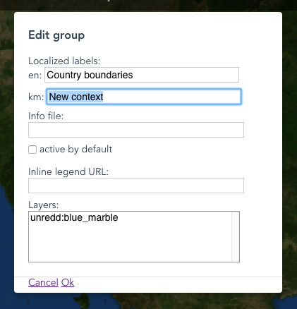
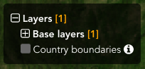
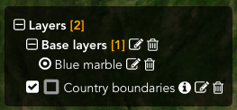
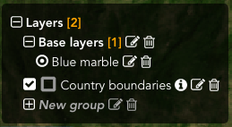
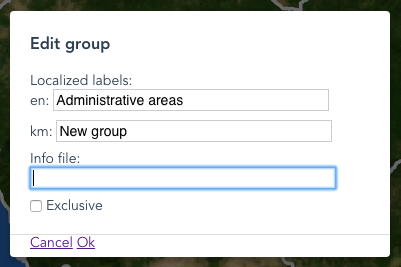

# SLMS Portal configuration manual

[Editing interface](#editing-interface)

[Layers](#layers)
- [Adding a new layer](#adding-a-new-layer)
- [Setting layers order](#setting-layers-order)
- [Deleting a layer](#deleting-a-layer)
- [Adding a layer legend](#adding-a-layer-legend)
- [Adding layer statistics](#adding-layer-statistics)

[Contexts](#contexts)
- [Adding a new context](#adding-a-new-context)
- [Configuring contexts](#configuring-contexts)
- [Deleting a context](#deleting-a-context)

[Groups](#groups)
- [Adding a new group](#adding-a-new-group)
- [Configuring groups](#configuring-groups)
- [Deleting a group](#deleting-a-group)

[Moving groups and contexts](#moving-groups-and-contexts)

<!--- ## Introduction --->
<!--- TODO --->

## Editing interface

To access the editing interface, click on the Admin link at the right of the banner. You will be sown a login form. Enter you credentials and then click "Login".

Two new buttons (Edit and Versions) will appear under the layers tree menu. These two buttons allow you to enter the editing interface and to restore a previous version of the configuration.

After clicking on the Edit button, additional editing buttons will appear besides each item in the tree menu, together with additional buttons under the menu:

* Layers
* Add Context
* Add Group

We'll go through all of the options in the next chapters. For now, let's see what layers, context and groups are.

## Layers

Layers represents connections to web mapping sources. It could be for instance a Bing Aerial map, a OpenStreetMap map, or any public wms layer published on the web. Layers are just logical connections, i.e. there's no user interface item corresponding to a layer.

### Adding a new layer

To add a new layer, first open the layers management dialog by clicking on the Layers button.

From the layer dialog you can add three different kinds of layers (more will be added in the future), by clicking on the related links:

* An OpenStreetMap layer
* A Bing aerial layer
* WMS layers

To add an OpenStreetMap or a Bing layer, just click on the link. No additional configuration is needed. Normally need to add at most one of each.

To add a WMS layer, click on the related link. An editing mask will be shown.

When adding a new layer, the default wms servers are used (defined in the `config.json` configuration file). You can choose your list of servers by checking *Custom server urls* and inserting a comma serparated list of servers.

WMS layers is a mandatory field. You can either type the WMS layer name manually, or click the *Get list of layers* button and selecting one from the *WMS layers* menu.

Choose the image format you prefer, depending on your needs (palette, transparency, size).

The optional fields *Source link* and *Source labels* are used to show credits on the lower right corner of the screen when the layer is visible on the map.

For legend and statistics please refer to the [Add a layer legend](#add-a-layer-legend) and [Add layer statistics](#add-layer-statistics) chapters.

### Setting layers order

Layers ordering is important, as you want the base layer to be behind the overlays (i.e. country boundaries, protected areas...). To set the ordering, drag and drop the layer names on the left of the layers dialog, by using the handler at the left of the name. When hovering the handler, the mouse cursor will show that you can drag them.

Layers on the top are at the bottom on the map, i.e. you want to put the base layers first, and then the overlays.

### Deleting a layer

To delete a layer, choose it from the list of layers at the left of the dialog, and click the *Delete this layer* link. A confirm dialog will be shown.

### Adding a layer legend

TODO

### Adding layer statistics

`/static/configuration/loc/$(_lang)/html/statistics/forest_classification.html`

TODO

## Contexts

Contexts are groups of layers. An forest context, for example, could include a forest classification map, NFI plots, and protected areas. Each item on the selection tree corresponds to a context (or to a group, see below). When activacting/deactivating a context, all the layer included in it are set to visible/invisible.

### Adding a new context

To add a context, click the *Add Context* button in e editing interface a context named *New context* will appear, it's grey as it doesn't contain any layer yet.

### Configuring contexts

To configure the context, click on the editing icon next to it's name.

### Changing context's name

To set the context name, edit the *Localized labels* field. There's one field per language. Languages are configured in the `config.json` file.

### Setting context's layers

To assign layers to a context, choose them from the *Layers* list in the context editing dialog. You can select multiple layers by pressing Ctrl (on Windows) or Command (on Mac) While clicking.

### Other options

Additional options are:

#### Info file

A link to a metadata file can be added by setting the Info file field. When not empty, a info icon will appear at the right of the context name in the tree menu.

The url can be relative or absolute, and it can be localized by adding `$(_lang)`, which will be resolbed to the code of the language being used.

A sample URL would be:

`/static/configuration/loc/$(_lang)/html/forest_classification.html`

#### Active by default

To make the layer active by default, when loading the page, check the *Active by default* checkbox.

#### Inline Legend URL

The inline legend URL is the url of a 32*32 image to be optionally shown next to the context. It's useful when the context contains only one layer with a simple symbology.

It's usually dynamically generated by GeoServer and it's of the form (either relative or absolute):

`/geoserver/wms?REQUEST=GetLegendGraphic&VERSION=1.0.0&FORMAT=image/png&WIDTH=20&HEIGHT=20&LAYER=country_boundaries&TRANSPARENT=true&legend_options=dpi:180&RULE=small`

## Deleting a context

To delete a context, click on the *bin* icon next to it.

## Groups

Groups can contain contexts or other groups. In the image below, for example, there's a main group (Layers) that contains the Base layers group, which in turns contains the Blue Marble context (which contains the blue_marble wms layer). As you can already see, we can build a tree of groups and contexts to organize our maps in categories and subcategories.

### Adding a new group

To add a group, click the *Add Group* button in e editing interface a context named *New group* will appear, it's grey as it doesn't contain any context yet.

### Configuring groups

As in context, you can set a group label for each language defined in the *config.json* file. Please refer to [Changing context's name](#changing-contexts-name) for reference.

You can also add an info file, please refer to [Layer info file](#info-file) for reference.

You can make the contexts in the group mutually exclusive by checking the *Exclusive* checkbox. This is useful for example for the base layers, where you want only one base layer to be active.

### Deleting a group

To delete a group, click on the *bin* icon next to it.

## Moving groups and contexts

Groups and context can be moved from one group to another by dragging them in the destination group. This allows to organize the content of the menu in a tree structure (category/subcategory/...). The destination group needs to be expanded.
