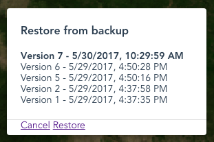

# SLMS Portal configuration manual

[Editing interface](#editing-interface)

[Layers](#layers)
- [Adding a new layer](#adding-a-new-layer)
- [Setting layers order](#setting-layers-order)
- [Deleting a layer](#deleting-a-layer)
- [Adding a layer legend](#adding-a-layer-legend)
- [Adding layer statistics](#adding-layer-statistics)

[Contexts](#contexts)
- [Adding a new context](#adding-a-new-context)
- [Configuring contexts](#configuring-contexts)
- [Deleting a context](#deleting-a-context)

[Groups](#groups)
- [Adding a new group](#adding-a-new-group)
- [Configuring groups](#configuring-groups)
- [Deleting a group](#deleting-a-group)
- [Organizing groups and contexts](#organizing-groups-and-contexts)

[Restoring previous configurations](#restoring-previous-configurations)

## Introduction

The administation user interface is used to add and delete maps from the portal, and to configure additional content (statistics, metadata). The text can be entered in different languages.

It is important to keep in mind that, when modifying the configuration, the changes are not saved until the administrator clicks on the *Save* button. This has the advantage that he can make bilk changes and only save when the configuration is consistent, but also has the disadvantage all the changes he made are lost if he forgets to save before closing or reloading the page.

Once a configuration is saved, all the previous ones, together with the current, are stored in a database and can be restored in case something goes wrong.

## Editing interface

To access the editing interface, click on the *Admin* link at the right of the banner. A login popup will open. Enter you credentials and click *Login*.

Two new buttons (*Edit* and *Versions*) will appear under the layers tree menu. These two buttons allow you to enter the editing interface and to restore a previous version of the configuration.

After clicking on the *Edit* button, additional editing buttons will appear besides each item in the tree menu, together with additional buttons under the menu:

* Add Group
* Add Context
* Layers
* Cancel
* Save

Changes are not saved until the administrator click on the *Save* button.

## Layers

In the portal, layers are connections to web mapping sources. It could be for instance a Bing Aerial map, an OpenStreetMap map, or any WMS layer published on the web. Layers are logical connections to the data source -- there's no element in the user interface corresponding to a layer.

To edit the layers configuration, open the layers configuration dialog by clicking on the *Layers* button.

You can either edit an existing layer by clickint on its name on the list of the left of the dialog, or add a new one.

When editing the layers, you are working on a *clone* of the layer configuration. You need to apply the changes by clicking on *Ok* (or cancel them by clicking on *Cancel*).

Please note that when clicking on *Ok*, the changes to the layers configuration is not saved yet but just applied to the current sets of changes. In order to permanently save it, you will need to click on the *Save* button.

### Adding a new layer

From the layer dialog you can add three different types of layers (more types will be added in the future), by clicking on the related links:

* An **OpenStreetMap** layer
* A **Bing Aerial** layer
* **WMS** layers

To add an OpenStreetMap or a Bing layer, just click on the link. No additional configuration is needed. Normally you need to add at most one of each.

To add a WMS layer, click on the *WMS* link. A new layer will be created and an editing mask will be shown.

When adding a new layer, the default WMS servers are used (defined in the `config.json` configuration file). You can choose your list of servers by checking *Custom server urls* and inserting a comma serparated list of WMS servers.

*WMS layers* is a mandatory field. You can either type the WMS layer name manually, or by clicking the *Get list of layers* button and selecting one from the *WMS layers* menu.

Choose the image format you prefer, depending on your needs (palette, transparency, size).

The optional fields *Source link* and *Source labels* are used to show credits on the lower right corner of the screen when the layer is visible on the map. The source label will be shown as a link to the URL chosen in *Source link*

For legend and statistics please refer to the [Add a layer legend](#add-a-layer-legend) and [Add layer statistics](#add-layer-statistics) chapters.

### Setting layers order

Layers ordering is important, as you want the base layer to be behind the overlays (*country boundaries*, *protected areas*, ...). To set the ordering, drag and drop the layer names on the left of the layers dialog, by using the handler at the left of the layer names.

Layers on the top of the list are at the bottom on the map. Base maps usually are at the top of the list.

### Deleting a layer

To delete a layer, select it from by clicking its name from the list of layers at the left of the dialog, and then click the *Delete this layer* button. A confirm dialog will be shown.

### Adding a layer legend

*TODO*

### Adding layer statistics

`/static/configuration/loc/$(_lang)/html/statistics/forest_classification.html`

*TODO*

## Contexts

Contexts are groups of layers. A forest context, for example, could include a forest classification map, NFI plots, and protected areas layers. All of them will appear at the same time when activating the context.

Normally, though, each context contains one layer.

Contexts are shown in the layers selection tree. They can be moved into groups to organize them in categories and subcategories (see [Groups](#groups) and [Organizing groups and contexts](#organizing-groups-and-contexts))

### Adding a new context

To add a context, click the *Add Context* button in the editing interface. A context named *New context* will appear, it will be *inactive* (grey), indicating that in doesn't contain any layer yet.

### Configuring contexts

To configure the context, click on the editing icon next to it's name in the layers selection tree.

### Changing context's name

To set the context name, edit the *Localized labels* field. There's one field per language. Languages are configured in the `config.json` file.

### Setting context's layers

To add layers to a context, choose them from the *Layers* list in the context editing dialog. As explained, a context can contain more than one layer - you can select multiple layers by pressing Ctrl (on Windows) or Command (on Mac) While clicking.

### Other options

Additional options are:

#### Info file

A link to a metadata file can be added by setting the Info file field. When not empty, a info icon will appear at the right of the context name in the tree menu.

The url can be relative or absolute, and it can be localized by adding `$(_lang)`, which will be resolbed to the code of the language being used.

The sample URL

`/static/configuration/loc/$(_lang)/html/forest_classification.html`

Would for example resolve both to `/static/configuration/loc/en/html/forest_classification.html` and `/static/configuration/loc/ft/html/forest_classification.html`

Depending on the current language.

#### Active by default

To make the layer active by default when loading the page, check the *Active by default* checkbox.

#### Inline Legend URL

You can add an inline legend URL is the url of a 32*32 image to be shown next to the context. It's useful when the context contains only one layer with a simple symbology.

It's usually dynamically generated by GeoServer, for example:

`/geoserver/wms?REQUEST=GetLegendGraphic&VERSION=1.0.0&FORMAT=image/png&WIDTH=20&HEIGHT=20&LAYER=country_boundaries&TRANSPARENT=true&legend_options=dpi:180&RULE=small`

## Deleting a context

To delete a context, click on the *trash bin* icon next to it.

## Groups

Groups can contain contexts or other groups. In the image above, for example, there's a main group (Layers) that contains the Base layers group, which in turns contains the Blue Marble context (which contains the blue_marble wms layer). You can build a tree structure of groups and contexts to organize your maps in categories and subcategories.

### Adding a new group

To add a group, click the *Add Group* button in the editing interface and a context named *New group* will appear, it's *inactive* (grey), indicating that it doesn't contain any context yet.

### Configuring groups

As for contexts, you can set a label for each language defined in the *config.json* file.

You can also add an info file, please refer to [Info file](#info-file) for reference.

You can make the contexts in the group mutually exclusive by checking the *Exclusive* checkbox. This is useful for example for the base layers, where you want only one of them to be active at once.

### Deleting a group

To delete a group, click on the *trash bin* icon next to it.

### Organizing groups and contexts

Groups and context can be moved from one group to another by dragging them in the destination group. This allows to organize the contents in a tree structure (category/subcategory/...). The destination group needs to be expanded in order to move an item into it.

## Restoring previous configurations

When you save a configuration by clicking on the *Save* button, a new configuration version is added to the version list. At any time, you can restore any of the old configurations by clicking on the *Versions* button.

To restore an old version, choose it from the list and click on the *Restore* button; To exit without restoring a previous version, click the *Cancel* button.

Old versions cannot be removed from the list.
